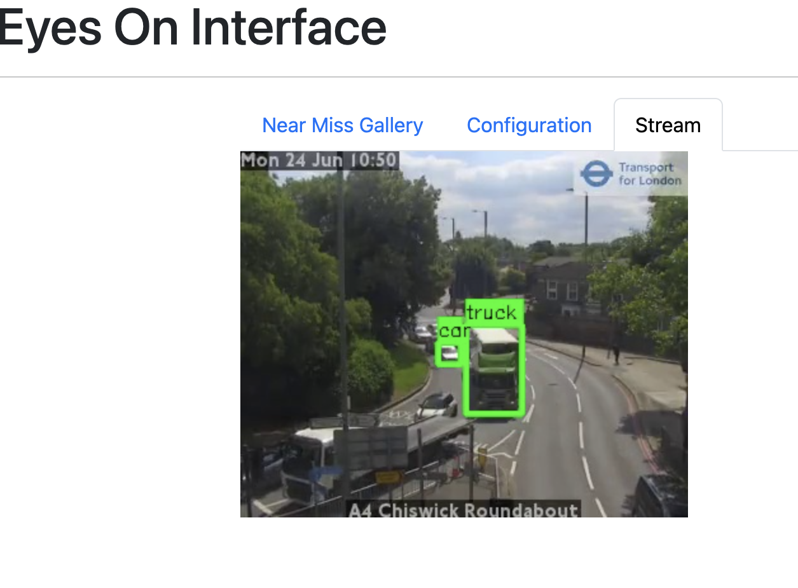
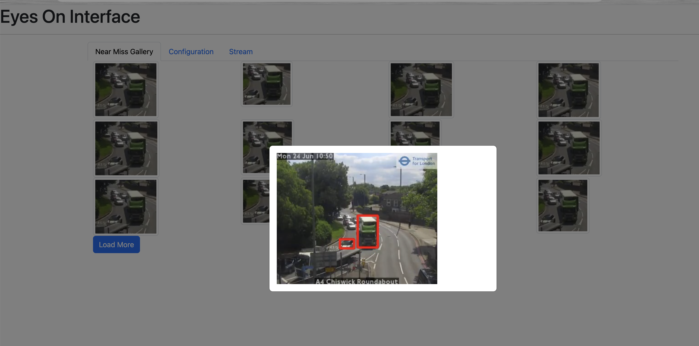
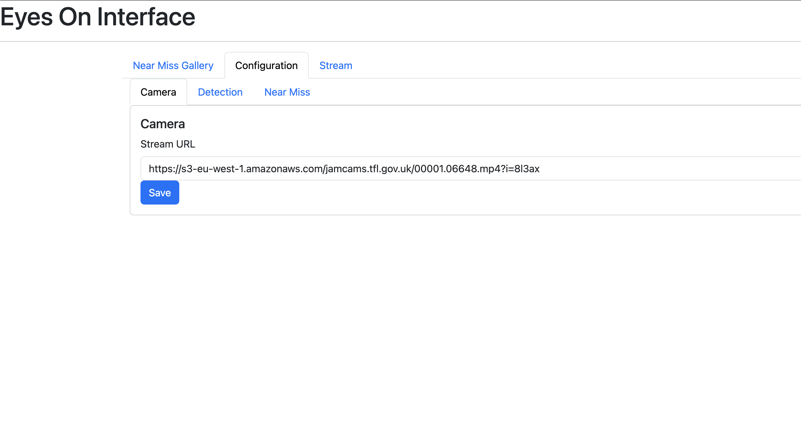
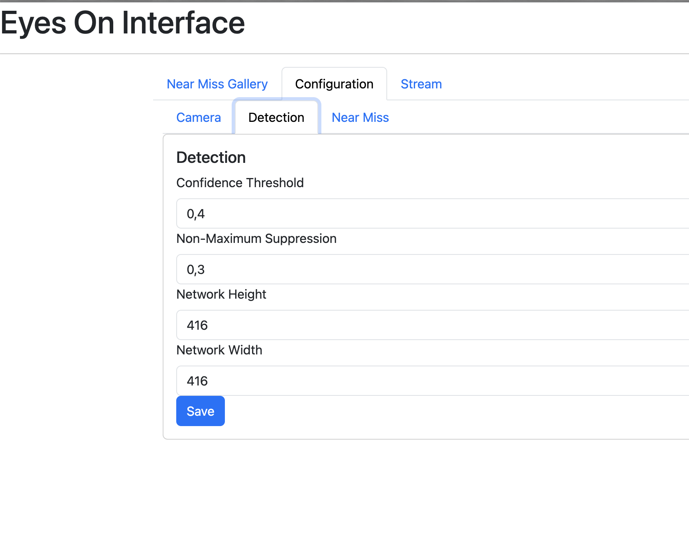
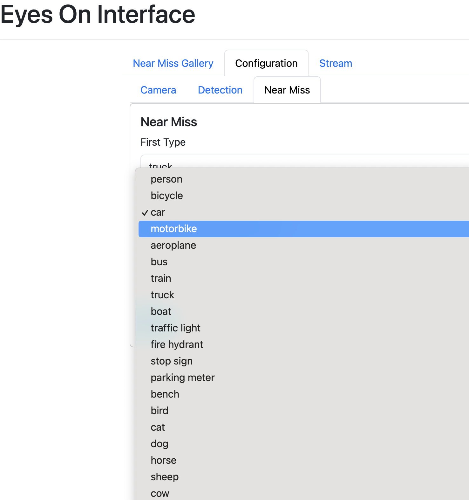
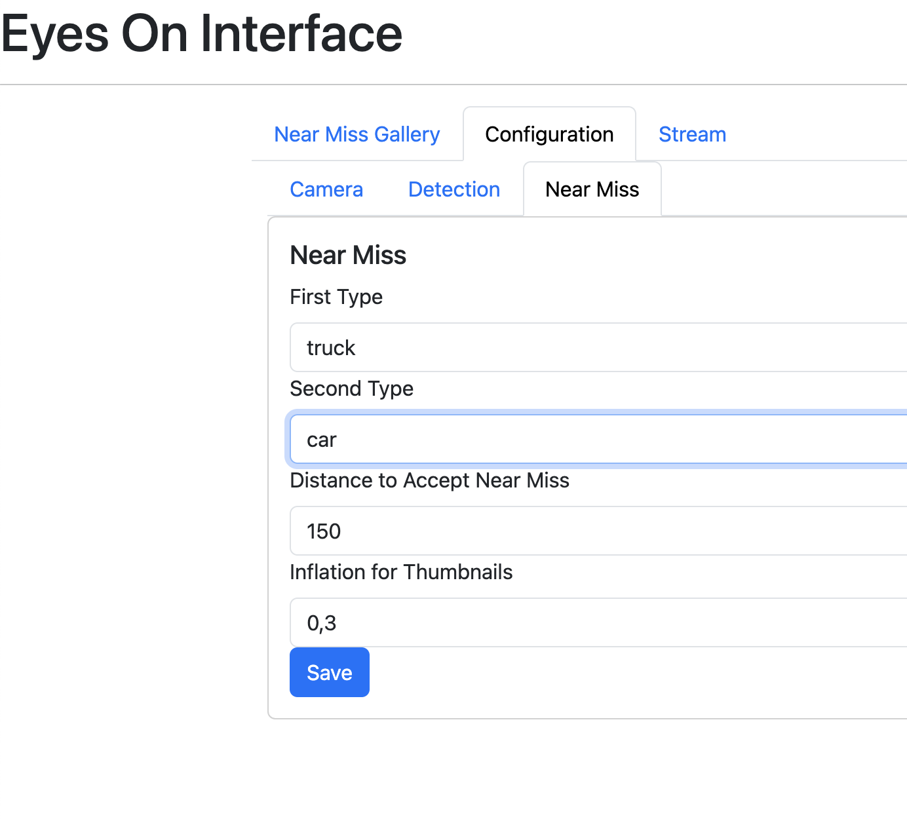

# 1. eyeson

## 1.1 Summary
eyeson is a personal project aimed at creating a visual monitoring system using computer vision techniques. The project utilizes a camera to capture live video feed and applies computer vision technologies to detect near misses.

The project can operate either:
- on a host machine locally due to performance concerns or
- with Docker containers for a quick setup.

## 1.2 Features
- Capturing live camera feeds
- Detecting objects in real-time
- Detecting near misses in real-time
- Saving near misses as images
- Configurable and monitorable via a web interface

## 1.3 Prerequisites

All prerequisites are tested on Mac OSX Sonoma 14.5.

- Docker (tested version 24.0.7, build afdd53b4e3)
- Docker-Compose (tested version v2.23.3-desktop.2)

## 1.4 Run

`docker-compose up --build`

## 1.5 Improvements

- The app can be controlled by a service, so the web interface might start/stop it.
- No automation tests were written.
- For security reasons, only the frontend port should be exposed.

# 2. App

## 2.1 Summary

This section will contain C++ application-related information. 

eyeson application has some basic functionalities:

- Working with configurable parameters
- Capturing frames from streams or videos
- Detecting objects using Darknet
- Detecting near misses with a primitive algorithm
- Saving captured near misses as whole images or small images

## 2.2 Prerequisites
- OpenCV 4
- C++ 14

## 2.3 Compile
```g++ -std=c++14 -pthread -o bin/eyeson src/main.cpp `pkg-config --cflags --libs opencv4` ```

## 2.4 Run
`bin/eyeson app/config/config.ini`

## 2.5 Configurations

### SOURCE

- path: video or feed URL
- loop: to run the same video continuously after it finishes

### DETECTOR

- weight: YOLO weight path
- config: YOLO config path
- names: YOLO coco name paths
- threshold: confidence threshold
- nms: NMS threshold value, to decide how close objects should be to be shown
- networkheight
- networkwidth

### NEARMISS

- class1: coco name for near miss
- class2: coco name for near miss
- output: folder to save near miss images
- distance: distance to accept two objects as a near miss
- inflationsmallimage: to have a better small image
- savebigimage
- savesmallimage

### DISPLAY_WINDOW

- name: window name

### DEBUG

- showframeindex
- stepbystepframe: the next frame will be fetched only if there is a hit for a space char
- showframefetcherror
- showdisplaywindow

### BACKEND

- savelastframe
- lastframepath

## 2.6 Improvements

- Communication between backend can be handled better.
- USB Camera support can be provided.
- There could be better exception handling.
- Tracking algorithms can be used to improve the quality of outputs.

# 3. Backend

## 3.1 Summary

There is a simple FastAPI application to have a web interface for the app.

It has basically three functionalities:

- Setting/Getting app configs
- Getting near miss images and thumbnails
- Getting last frame

## 3.2 Prerequisites

- python (tested version 3.12.2)
- pip (tested version 24.0)

## 3.3 Install

`pip install -r requirements.txt`

## 3.4 Run

With specifying config file path:

`CONFIG_FILE=app/config/config.ini uvicorn app.main:app --reload`

or if config file is under `/app/config/config.ini`, can be run directly

`uvicorn app.main:app --reload`

## 3.5 Improvements

- Security can be improved, no credential check currently exists
- Last frame communication is based on files which is far from ideal. It can be replaced with memory.
- We can keep the last 10-20 frames in memory so there could be smooth streaming.

# 4. Frontend

## 4.1 Summary

There is a simple React application to have a web interface for the app.

It has basically three functionalities:

- Showing near miss gallery
- Showing and updating app configurations
- Showing the app stream

## 4.2 Prerequisites

- node (tested version v20.5.1)
- npm (tested version 9.8.0)

## 4.3 Install

`npm install`

## 4.4 Run

`npm start`

If there is any SSL-related issue in local runs, type the command below and re-run `npm start`

```
export NODE_OPTIONS=--openssl-legacy-provider
```

## 4.5 Configurations

Configuration form visualization is handled dynamically with help of the `config.ini` file. There are two sections in `config.ini` to help this visualization: `WEB_INTERFACE_LABELS` and `WEB_INTERFACE_TYPES`.
 
## 4.6 Improvements

- State management can be centralized.
- Component separation can be better.
- Showing the app stream can be improved.
- Configuration form handling can be improved.
- Service URL can be fetched from a config file.
- There could be a better UI.

# Screenshots












